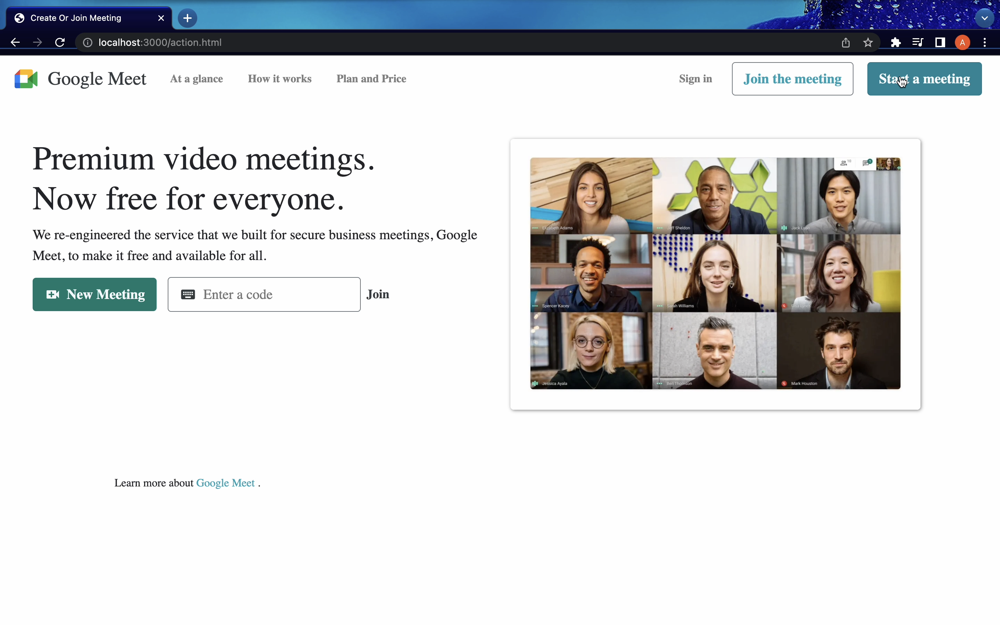
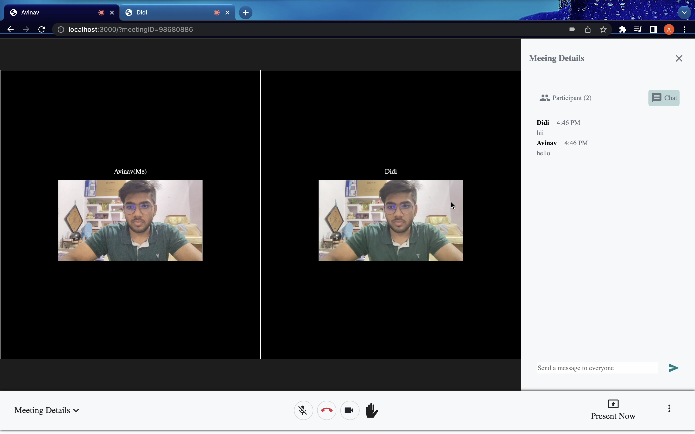

 # Google Meet

This project is a Video Conferencing and Chat application built to achieve effortless video calls and meetings. We connect people through smooth video, voice, chat, file sharing, screen recording and enable face-to-face video experiences for people in a single meeting across devices and locations.


## Home Page



## Room Page




## Features
- Start a new meeting 
- Join an existing meeting with unique roomId
- Start/Stop Video and Audio
- View other participants and chat with them
- Present your screen to participants
- Start Screen Recording
- Share Files via chat


## Run Locally

Clone the project

```bash
  git clone https://github.com/yavinav08/Google-Meet.git
```

Go to the project directory

```bash
  cd Google-Meet
```

Install dependencies 

```bash
  npm install
```


Start the server

```bash
  npm start # it will run on localhost:3000
```

And you are ready to go!

## Technology Stack:
  1) Node Js
  2) Bootstrap
  3) Express JS
  4) Socket IO
  5) WebRTC

